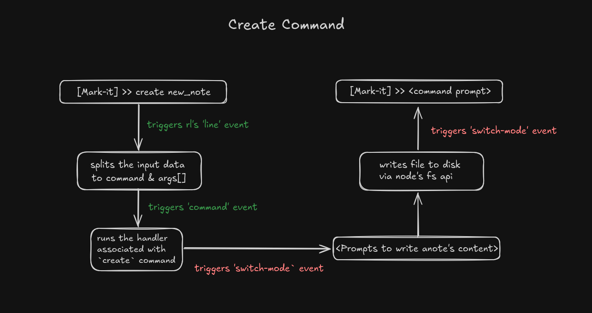

# mark-it

`mark-it` is a simple cli tool for **markdown** note-taking. This is a very minimal version of the tool with basic crud functionality and no fancy formatting.

## How is application this designed?

This cli application is an **event-driven** application. Any operations such as creating notes, updating notes, etc, are triggered via `events`. For example, each command entered by the user in the console/terminal via the `rl` (readline) interface emits an event called `command` which further determines what operation is to be performed.

Here is a quick example diagram to visualize for the `create` command:



A short breakdown of the above diagram:

- The user enters `create new_note`.
- The `rl` interface recieves the input, splits to input to diffrentiate the command and arguments and emits the `command` event.

- The `command` event triggers, and uses the split input to determine which operation to run, in this case its the `create` operation.
- The respective handler function runs for the `create` operation (`readNoteStream`). This function emits the `switch-mode` event to switch the input mode from reading commands to reading the markdown note content.
- The input mode is switched to `note-content` and the input is collected. After the user completes writing the notes, another function is called to create the file and write the contents to it via the `fs` api.
- After writing the file to disk, `switch-mode` event is called again to switch the input mode back to reading commands.  

A similar process happens for other commands as well.

## Basic functionialities this application supports

All created markdown notes are stored in `~/Documents/mark-it/notebooks/`
.
- Creating Notes - Creates a new markdown note.
```bash
create [filename]
```

- Updating Notes - Updates an existing markdown note.
```bash
update [filename]
```

- Deleting Notes - Deletes an existing markdown note.
```bash
delete [filename]
```

- Reading Notes - Reads an existing markdown note.
```bash
get [filename]
```

- Listing All Notes - Lists all available markdown notes.
```bash
list [filename]
```

## Examples

The initial input prompt for `mark-it` looks like this:
```bash
<< Type a command (help to list commands) >>
[Mark-It] >> 
```

To create a new note simply do:
```bash
[Mark-It] >> create new_note
```
It then prompts to enter the markdown note contents. This is where the user can write the note contents as shown below:
```bash
===== Enter Note Content =====

# This is a new note
- hello world!
```

To finish writing the notes, simply enter `:exit`. It then displays the following:
```bash
===== End Of Note Content =====
```

To list all the available `markdown` files, simply do:
```bash
[Mark-It] >> list
```
This will then display all the created markdown files stored in `~/Documents/mark-it/notebooks/`:
```bash
===== All Notebooks =====

1: new_note.md

===== End Of Notebook List =====
```
Since we only created one note, it only lists a single note.

Similarly, you can play around with the other commands.

```
Note: The update command opens the nano text editor for the user to edit the markdown contents.
```

Clear messages are displayed in case of invalid inputs to indicate the source of the problem. For example, running the `create` command without the `filename` argument will result in the following:
```bash
[Mark-It] >> create
<<<<< create command requires filename as argument >>>>>
```

Users can also enter `help` to view the list of available commands along with their arguments.
```bash
[Mark-It] >> help

----- Welcome To Mark-It: Commands List -----

 - add: create [filename] - Creates a new md note

 - delete: delete [filename] - Deletes a md note

 - update: update [filename] - Updates a md note

 - list: list - Lists all available md notes

 - close: close - Closes mark-it

 - help: help - Displays supports commands

 - clear: clear - Clears the screen

```

Feel free to explore all the available commands.

## Learnings

I built this project to primarily practice **TypeScript** and re-familiarize myself with the `fs`, `rl` node api's. Apart from that, this project also taught me, in more detail, about event-driven architectures in NodeJS.

I've noticed that, the code I've written might need to be completely refactored when the applications's complexity increases in the future. I'll be trying to code-review and try to understand what I could have done better.

## Features To Add
- Better input/output formatting.
- A simple markdown-parser to display the markdown file's content properly.
- Folder support to organize markdown notes.
- Tab Completion and Auto Completion.
- Bookmarks to bookmark important notes or notes to refer later.

```
Note: It might take a while before I'll re-visit this project, but I'll definitely try to build a really good cli-based markdown note-taking application.
```

